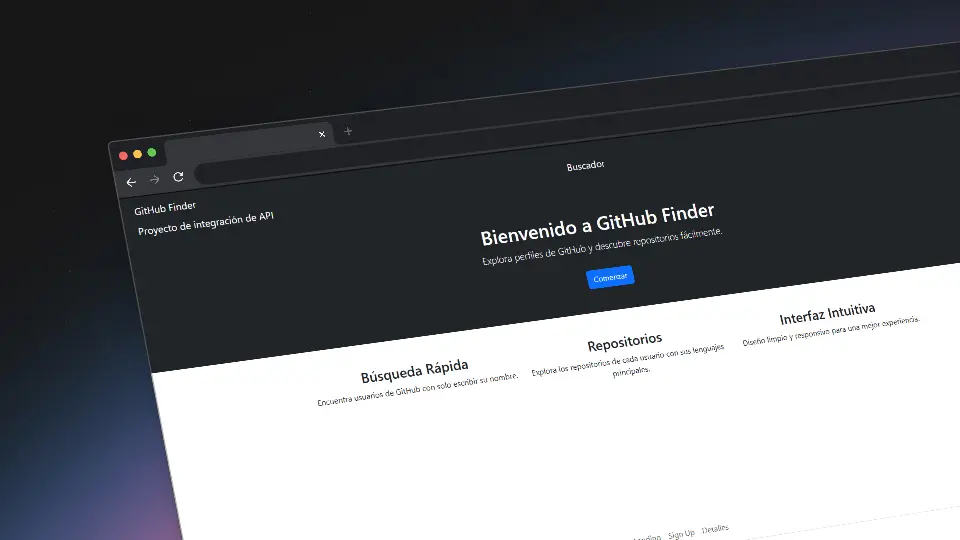
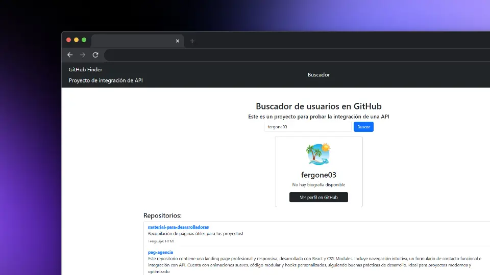
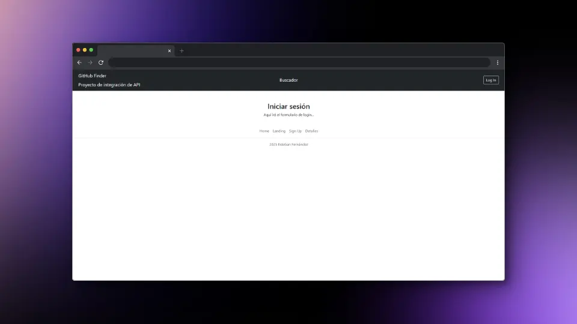

<div align="left" style="position: relative;">

<h1>GITHUB-FINDER</h1>
<p align="left">
</p>
<p align="left">
    <!-- Shields.io badges disabled, using skill icons. --></p>
<p align="left">Construido con:</p>
<p align="left">
    <a href="https://skillicons.dev">
        
    </a></p>
</div>
<br clear="right">

## 🔗 Tabla de Contenidos

- [📍 Resumen](#-resumen)
- [👾 Características](#-características)
- [📁 Estructura del Proyecto](#-estructura-del-proyecto)
  - [📂 Índice del Proyecto](#-índice-del-proyecto)
- [🚀 Comenzando](#-comenzando)
  - [☑️ Prerrequisitos](#-prerrequisitos)
  - [⚙️ Instalación](#-instalación)
  - [🤖 Uso](#🤖-uso)
- [📌 Hoja de Ruta del Proyecto](#-hoja-de-ruta-del-proyecto)

---

## 📍 Resumen

Este proyecto es una aplicación web diseñada para aprender y practicar la integración de APIs. Está desarrollado como parte de mi investigación de cara a mis prácticas de Desarrollo de Aplicaciones Web (DAW).

Se exploran varias herramientas de desarrollo web, como React para la construcción de interfaces de usuario y Bootstrap para el diseño responsivo y estilizado. PHP puro se utiliza para la API.

---

## 👾 Características

- **Integración de APIs:** La aplicación permite la integración con diversas APIs para obtener y mostrar información relevante.
- **Interfaz de Usuario con React:** Utiliza React para construir una interfaz de usuario dinámica y responsiva.
- **Diseño Responsivo:** Implementa Bootstrap para asegurar que la aplicación se vea bien en dispositivos de diferentes tamaños.
- **Backend con PHP:** Utiliza PHP puro para manejar las solicitudes de la API y la lógica del servidor.
- **Gestión de Estado:** Maneja el estado de la aplicación de manera eficiente utilizando React hooks.
- **Componentes Reutilizables:** La aplicación está construida con componentes reutilizables para facilitar el mantenimiento y la escalabilidad.
- **Pruebas Automatizadas:** Incluye un conjunto de pruebas para asegurar la calidad del código y el correcto funcionamiento de la aplicación.
- **Documentación Completa:** Proporciona una documentación detallada para facilitar la instalación, uso y contribución al proyecto.



---

## 📁 Estructura del Proyecto

```sh
└── GITHUB-FINDER/
    ├── README.md
    ├── backend
    │   ├── README.md
    │   └── api.php
    └── frontend
        ├── .gitignore
        ├── README.md
        ├── eslint.config.js
        ├── index.html
        ├── package-lock.json
        ├── package.json
        ├── public
        ├── src
        └── vite.config.js
```


### 📂 Índice del Proyecto
<details open>
    <summary><b><code>GITHUB-FINDER/</code></b></summary>
        <details> <!-- __root__ Submodule -->
            <summary><b>__root__</b></summary>
            <blockquote>
                <table>
                </table>
            </blockquote>
        </details>
        <details> <!-- backend Submodule -->
            <summary><b>backend</b></summary>
            <blockquote>
                <table>
                <tr>
                    <td><b><a href='https://github.com/fergone03/GITHUB-FINDER/blob/master/backend/api.php'>api.php</a></b></td>
                    <td><code>❯ Archivo principal de la API de GitHub</code></td>
                </tr>
                </table>
            </blockquote>
        </details>
        <details> <!-- frontend Submodule -->
            <summary><b>frontend</b></summary>
            <blockquote>
                <table>
                <tr>
                    <td><b><a href='https://github.com/fergone03/GITHUB-FINDER/blob/master/frontend/package-lock.json'>package-lock.json</a></b></td>
                    <td><code>❯ Archivo de dependencias</code></td>
                </tr>
                <tr>
                    <td><b><a href='https://github.com/fergone03/GITHUB-FINDER/blob/master/frontend/vite.config.js'>vite.config.js</a></b></td>
                    <td><code>❯ Configuración de Vite</code></td>
                </tr>
                <tr>
                    <td><b><a href='https://github.com/fergone03/GITHUB-FINDER/blob/master/frontend/package.json'>package.json</a></b></td>
                    <td><code>❯ Archivo de configuración de npm</code></td>
                </tr>
                <tr>
                    <td><b><a href='https://github.com/fergone03/GITHUB-FINDER/blob/master/frontend/index.html'>index.html</a></b></td>
                    <td><code>❯ Archivo HTML principal</code></td>
                </tr>
                <tr>
                    <td><b><a href='https://github.com/fergone03/GITHUB-FINDER/blob/master/frontend/eslint.config.js'>eslint.config.js</a></b></td>
                    <td><code>❯ Configuración de ESLint</code></td>
                </tr>
                </table>
                <details>
                    <summary><b>src</b></summary>
                    <blockquote>
                        <table>
                        <tr>
                            <td><b><a href='https://github.com/fergone03/GITHUB-FINDER/blob/master/frontend/src/index.css'>index.css</a></b></td>
                            <td><code>❯ Estilos globales</code></td>
                        </tr>
                        <tr>
                            <td><b><a href='https://github.com/fergone03/GITHUB-FINDER/blob/master/frontend/src/App.css'>App.css</a></b></td>
                            <td><code>❯ Estilos de la aplicación</code></td>
                        </tr>
                        <tr>
                            <td><b><a href='https://github.com/fergone03/GITHUB-FINDER/blob/master/frontend/src/App.jsx'>App.jsx</a></b></td>
                            <td><code>❯ Componente principal de la aplicación</code></td>
                        </tr>
                        <tr>
                            <td><b><a href='https://github.com/fergone03/GITHUB-FINDER/blob/master/frontend/src/main.jsx'>main.jsx</a></b></td>
                            <td><code>❯ Punto de entrada de la aplicación</code></td>
                        </tr>
                        </table>
                        <details>
                            <summary><b>components</b></summary>
                            <blockquote>
                                <table>
                                <tr>
                                    <td><b><a href='https://github.com/fergone03/GITHUB-FINDER/blob/master/frontend/src/components/Header.jsx'>Header.jsx</a></b></td>
                                    <td><code>❯ Componente del Header</code></td>
                                </tr>
                                <tr>
                                    <td><b><a href='https://github.com/fergone03/GITHUB-FINDER/blob/master/frontend/src/components/UserCard.jsx'>UserCard.jsx</a></b></td>
                                    <td><code>❯ Componente de tarjeta de usuario</code></td>
                                </tr>
                                <tr>
                                    <td><b><a href='https://github.com/fergone03/GITHUB-FINDER/blob/master/frontend/src/components/SearchBar.jsx'>SearchBar.jsx</a></b></td>
                                    <td><code>❯ Componente de barra de búsqueda</code></td>
                                </tr>
                                <tr>
                                    <td><b><a href='https://github.com/fergone03/GITHUB-FINDER/blob/master/frontend/src/components/Footer.module.css'>Footer.module.css</a></b></td>
                                    <td><code>❯ Estilos del footer</code></td>
                                </tr>
                                <tr>
                                    <td><b><a href='https://github.com/fergone03/GITHUB-FINDER/blob/master/frontend/src/components/Footer.jsx'>Footer.jsx</a></b></td>
                                    <td><code>❯ Componente del footer</code></td>
                                </tr>
                                <tr>
                                    <td><b><a href='https://github.com/fergone03/GITHUB-FINDER/blob/master/frontend/src/components/Header.module.css'>Header.module.css</a></b></td>
                                    <td><code>❯ Estilos del Header</code></td>
                                </tr>
                                <tr>
                                    <td><b><a href='https://github.com/fergone03/GITHUB-FINDER/blob/master/frontend/src/components/RepoList.jsx'>RepoList.jsx</a></b></td>
                                    <td><code>❯ Componente de lista de repositorios</code></td>
                                </tr>
                                </table>
                            </blockquote>
                        </details>
                        <details>
                            <summary><b>pages</b></summary>
                            <blockquote>
                                <table>
                                <tr>
                                    <td><b><a href='https://github.com/fergone03/GITHUB-FINDER/blob/master/frontend/src/pages/AboutPage.jsx'>AboutPage.jsx</a></b></td>
                                    <td><code>❯ Página de información</code></td>
                                </tr>
                                <tr>
                                    <td><b><a href='https://github.com/fergone03/GITHUB-FINDER/blob/master/frontend/src/pages/HomePage.jsx'>HomePage.jsx</a></b></td>
                                    <td><code>❯ Página de inicio</code></td>
                                </tr>
                                <tr>
                                    <td><b><a href='https://github.com/fergone03/GITHUB-FINDER/blob/master/frontend/src/pages/Landing.jsx'>Landing.jsx</a></b></td>
                                    <td><code>❯ Página de landing</code></td>
                                </tr>
                                <tr>
                                    <td><b><a href='https://github.com/fergone03/GITHUB-FINDER/blob/master/frontend/src/pages/LoginPage.jsx'>LoginPage.jsx</a></b></td>
                                    <td><code>❯ Página de inicio de sesión</code></td>
                                </tr>
                                </table>
                            </blockquote>
                        </details>
                    </blockquote>
                </details>
            </blockquote>
        </details>
</details>

---
## 🚀 Comenzando

### ☑️ Prerrequisitos

Antes de comenzar con GITHUB-FINDER, asegúrate de que tu entorno de ejecución cumpla con los siguientes requisitos:

- **Lenguaje de Programación:** JavaScript
- **Gestor de Paquetes:** Npm
- **Servidor Web:** Apache o Nginx


### ⚙️ Instalación

Instala GITHUB-FINDER usando uno de los siguientes métodos:

**Construir desde el código fuente:**

1. Clona el repositorio GITHUB-FINDER:
```sh
❯ git clone https://github.com/fergone03/GITHUB-FINDER
```

2. Navega al directorio del proyecto:
```sh
❯ cd GITHUB-FINDER
```

3. Instala las dependencias del proyecto:


**Usando `npm`** &nbsp; [](https://www.npmjs.com/)

```sh
❯ npm install
```


### 🤖 Uso
Ejecuta GITHUB-FINDER usando el siguiente comando desde el directorio frontend:
**Usando `npm`** &nbsp; [](https://www.npmjs.com/)

```sh
❯ npm run dev
```
Ejecuta la api usando el siguiente comando desde el directorio backend:

```sh
❯ php -S localhost:3000 api.php
```

---
## 📌 Hoja de Ruta del Proyecto


- **Implementar un sistema de inicio de sesión que registre los últimos 10 usuarios buscados en la página del buscador. Si el usuario no está registrado, no se guardará ninguna información.**

---

